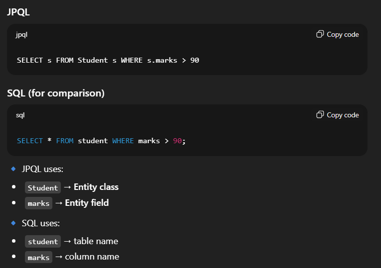
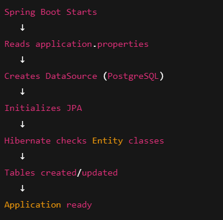
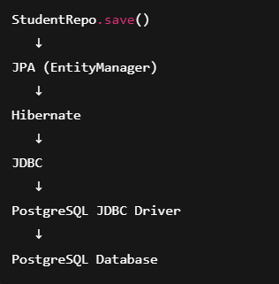

## Spring Boot + Spring Data JPA - Student Management

A simple Spring Boot application that demonstrates how to use Spring Data JPA with Hibernate to persist 
Java objects into a relational database.

Uses Spring Data JPA to perform database operations without writing SQL or DAO code

**@SpringBootApplication**(Main Class) &rarr; What happens internally?
* Component Scanning
* JPA configuration, Hibernate setup, DataSource creation.

**ApplicationContext**

`ApplicationContext context =
SpringApplication.run(SpringDataJpaApplication.class, args);`

* Starts Spring Boot
* Creates all beans
* Connects to DB
* Initializes Hibernate + JPA

**Model Package &rarr; Student**

* `@Entity` - Marks this class as a JPA Entity. JPA/Hibernate will **map** this class to a database table.
* Each obj of `Student` class = 1 row in table
* `@Id` marks class property as **Primary Key**. Every row must have a PK or can use `@GeneratedValue` annotation to automatically create one.
* `@Component` makes `Student` a Spring Bean and allows Spring to **create and manage objects** of `Student`

**repo.save(s1)**

* Spring Data JPA calls `EntityManager.persist()`
* EntityManager delegates to `Hibernate`
* Hibernate **generates SQL**

`  INSERT INTO student (roll_no, name, marks)
  VALUES (1, 'Harry', 100);`

* Row is inserted to DB. Transaction is committed. 



### Application Properties: 

`spring.datasource.driver-class-name=org.postgresql.Driver` &rarr; JDBC Driver.

Java does not understand database-specific protocols.

Each database (PostgreSQL, MySQL, Oracle, etc.) speaks a different language.

✔ JDBC driver converts:

* Java JDBC calls → database-specific commands

* Database responses → Java objects

JDBC Driver is a database-specific implementation that allows Java applications to communicate with databases using JDBC APIs.





`spring.jpa.hibernate.ddl-auto=update` &rarr; DDL Auto Strategy

Controls how Hibernate manages database tables.

| Value         | Meaning                                                                 |
| ------------- |-------------------------------------------------------------------------|
| `create`      | Drops & recreates tables on startup                                     |
| `create-drop` | Creates on start, drops on shutdown                                     |
| `update`      | Tables are created if missing. Columns are added if new fields appear ✅ |
| `validate`    | Only validates schema                                                   |
| `none`        | No schema management                                                    |

If an _object prints memory reference_, it means toString() is not overridden.

### JPQL 

**JPQL** (Java Persistence Query Language) is a query language used in JPA to fetch and manipulate
data using **entity objects, not database tables**.


🔹 Why JPQL is used

* **Database-independent and Object-oriented**

* Portable across databases

* Works with JPA providers (Hibernate, EclipseLink)

```
    List<Student> findByName(String name);
    List<Student> findByMarksGreaterThan(int marks);
```